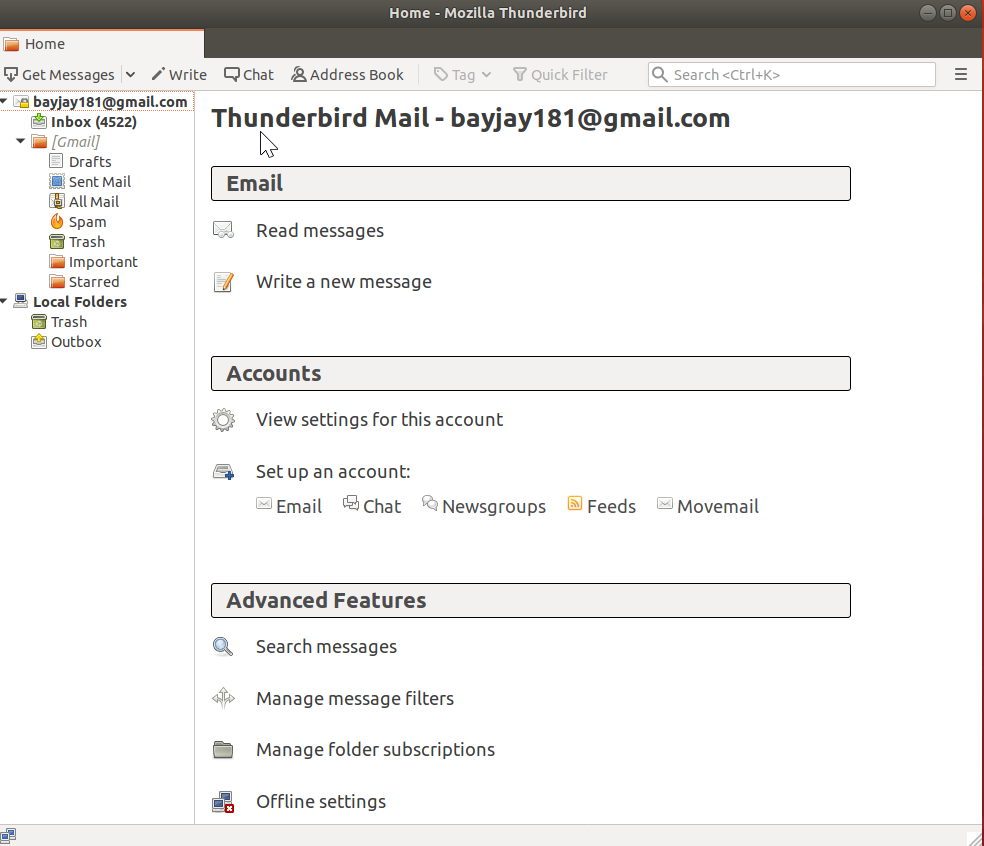
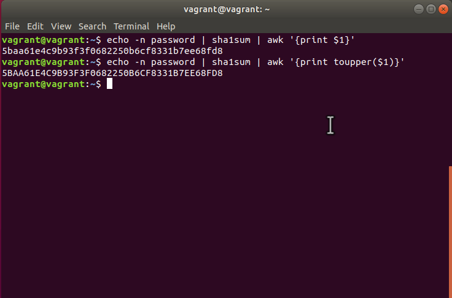
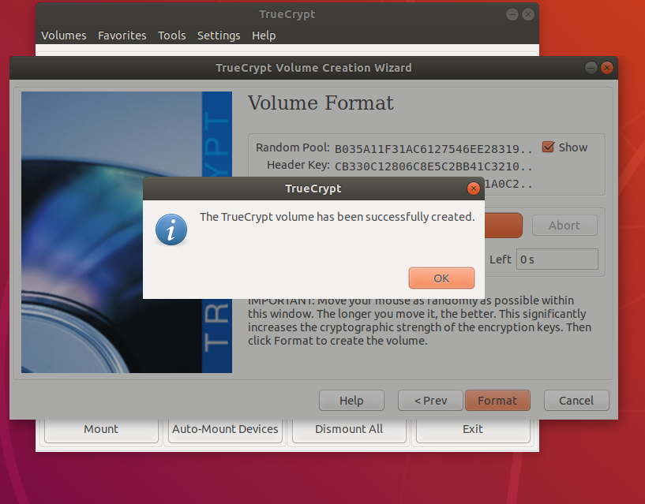
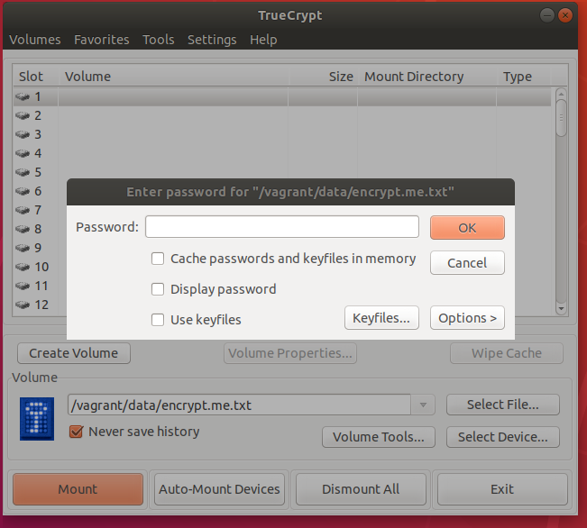
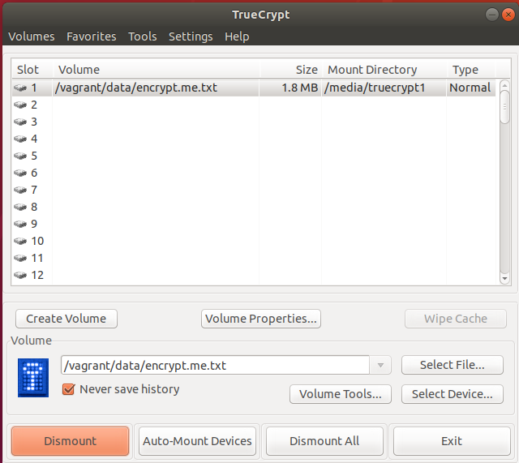
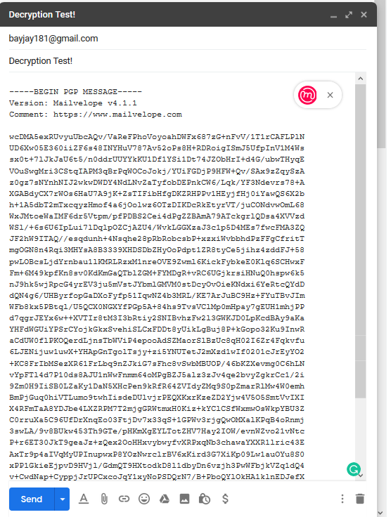
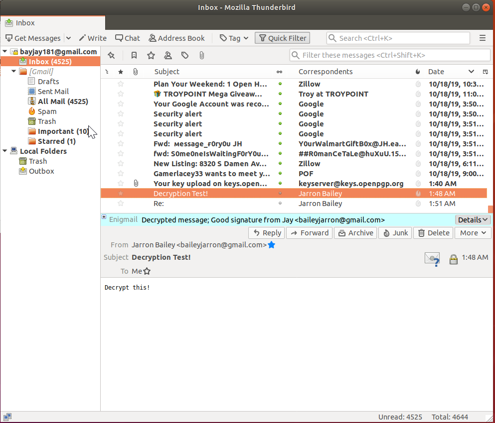
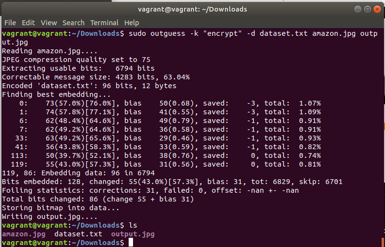
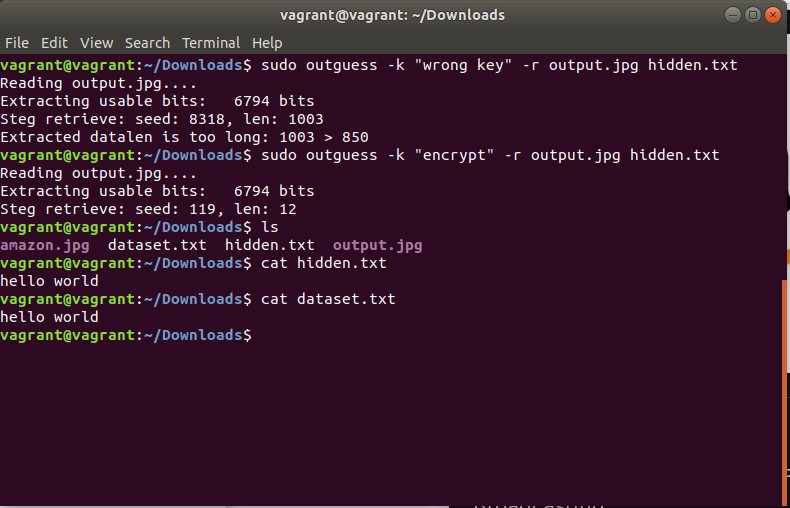

By: Jarron Bailey

# Software Code & Threat Analysis Presentation

## Table of Contents

- [Software Code & Threat Analysis Presentation](#software-code--threat-analysis-presentation)
  - [Table of Contents](#table-of-contents)
    - [1. Install and configure GNU privacy guard (GNUPG)](#1-install-and-configure-gnu-privacy-guard-gnupg)
    - [2. Generate a SHA1 hash from the command-line in Linux`](#2-generate-a-sha1-hash-from-the-command-line-in-linux)
    - [3. Install and configure TrueCrypt](#3-install-and-configure-truecrypt)
    - [4. Send encrypted email (includes exchanging digital certificates and decrypting email)](#4-send-encrypted-email-includes-exchanging-digital-certificates-and-decrypting-email)
      - [Encrypt](#encrypt)
      - [Decrypt](#decrypt)
    - [5. Install and configure TOR (includes performing a search)](#5-install-and-configure-tor-includes-performing-a-search)
    - [6. Perform a basic stenography encryption](#6-perform-a-basic-stenography-encryption)
      - [Encrypt](#encrypt-1)
      - [Decrypt](#decrypt-1)

### 1. Install and configure GNU privacy guard (GNUPG)

### 2. Generate a SHA1 hash from the command-line in Linux`

**vagrant@vagrant**:~$ echo -n password | sha1sum | awk '{print $1}'
5baa61e4c9b93f3f0682250b6cf8331b7ee68fd8
**vagrant@vagrant**:~$ echo -n password | sha1sum | awk '{print toupper($1)}'
5BAA61E4C9B93F3F0682250B6CF8331B7EE68FD8

### 3. Install and configure TrueCrypt

### 4. Send encrypted email (includes exchanging digital certificates and decrypting email)

#### Encrypt

#### Decrypt

### 5. Install and configure TOR (includes performing a search)

### 6. Perform a basic stenography encryption

#### Encrypt

#### Decrypt

