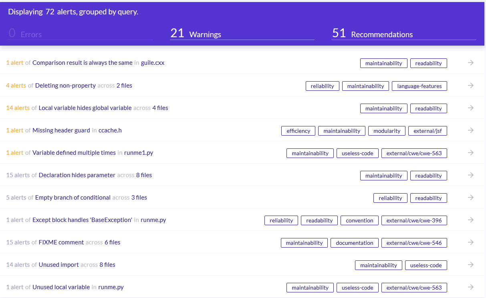
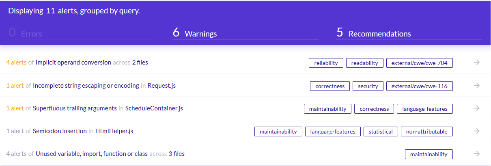
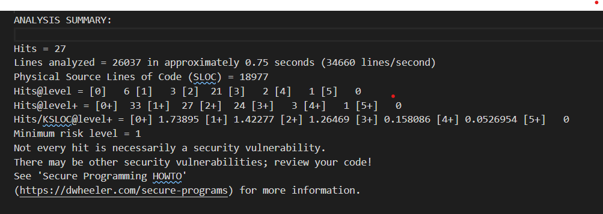

# Software Code & Threat Analysis Presentation

## SWIG

- **Application Description**: A code generator for connecting C/C++ with other programming languages
  SWIG is a compiler that integrates C and C++ with languages including Perl, Python, Tcl, Ruby, PHP, Java, C#, D, Go, Lua, Octave, R, Scheme (Guile, MzScheme/Racket), Scilab, Ocaml. SWIG can also export its parse tree into XML.
  SWIG reads annotated C/C++ header files and creates wrapper code (glue code) in order to make the corresponding C/C++ libraries available to the listed languages, or to extend C/C++ programs with a scripting language.
- **SourceForge**: [https://sourceforge.net/projects/swig/](https://sourceforge.net/projects/swig/)
- **Github**: [https://sourceforge.net/projects/swig/](https://github.com/swig/swig)
- **Static code analysis software**: [LGTM](https://lgtm.com/)
  

### CWE's

- 563
  **Title**: CWE-563: Assignment to Variable without Use
  - **Description**: After the assignment, the variable is either assigned another value or goes out of scope. It is likely that the variable is simply vestigial, but it is also possible that the unused variable points out a bug.
  - **Mitigation**: Remove unused variables from the code.
- 396
  - **Title**: CWE-396: Declaration of Catch for Generic Exception
  - **Description**: Multiple catch blocks can get ugly and repetitive, but "condensing" catch blocks by catching a high-level class like Exception can obscure exceptions that deserve special treatment or that should not be caught at this point in the program. Catching an overly broad exception essentially defeats the purpose of Java's typed exceptions, and can become particularly dangerous if the program grows and begins to throw new types of exceptions. The new exception types will not receive any attention.
  - **Mitigation**: Use typed exception handling
- 546
- **Title**: CWE-546: Suspicious Comment
- **Description**: Many suspicious comments, such as BUG, HACK, FIXME, LATER, LATER2, TODO, in the code indicate missing security functionality and checking. Others indicate code problems that programmers should fix, such as hard-coded variables, error handling, not using stored procedures, and performance issues.
  - **Mitigation**: Remove comments that suggest the presence of bugs, incomplete functionality, or weaknesses, before deploying the application.

## MedKey

- **Application Description**: Free professional hostpital information system. Based on modern web technologies and instruments (PHP7, JavaScript ES7, ReactJS) provide fast and scalable server-side and user-friendly UX/UI.
- **Application features**:
  - Electronic regisration: online appointment via website and other channels (social media and etc.)
  - Electronic Health Record (EHR)
  - Personnel accounting and specialists load forecasting & planning
  - Inventory and expendable materials accounting
  - Client service quality control instruments
- **SourceForge**: [https://sourceforge.net/projects/jahshaka/](https://sourceforge.net/projects/jahshaka/)
- **Github**: [https://github.com/medkey-org/medkey](https://github.com/medkey-org/medkey)
- **Static code analysis software**: [LGTM](https://lgtm.com/)
  

### CWE's

- 704
  **Title**: CWE-704: Incorrect Type Conversion or Cast
  - **Description**: The software does not correctly convert an object, resource, or structure from one type to a different type.
  - **Mitigation**: Review and ensure casting is designated for the correct variables.
- 116
  - **Title**: CWE-116: Improper Encoding or Escaping of Output
  - **Description**: Improper encoding or escaping can allow attackers to change the commands that are sent to another component, inserting malicious commands instead. If an application uses attacker-supplied inputs to construct a structured message without properly encoding or escaping, then the attacker could insert special characters that will cause the data to be interpreted as control information or metadata. Consequently, the component that receives the output will perform the wrong operations, or otherwise interpret the data incorrectly.
  - **Mitigation**:
    1. Use a vetted library or framework that does not allow this weakness to occur or provides constructs that make this weakness easier to avoid.
    2. If available, use structured mechanisms that automatically enforce the separation between data and code. These mechanisms may be able to provide the relevant quoting, encoding, and validation automatically, instead of relying on the developer to provide this capability at every point where output is generated.
    3. Understand the context in which your data will be used and the encoding that will be expected. This is especially important when transmitting data between different components, or when generating outputs that can contain multiple encodings at the same time, such as web pages or multi-part mail messages. Study all expected communication protocols and data representations to determine the required encoding strategies.
    4. Use input validation as a defense-in-depth measure to reduce the likelihood of output encoding errors (see CWE-20).

## Jahshaka

- **Application Description**: The virtual reality authoring toolkit that was created by artists, for artists. The only way to build and publish virtual worlds.
- **Application features**:
  - View scenes in virtual reality via the Oculus Rift
  - Build and share your scenes with the world
  - Particle System
  - Animation Editor
  - Skeletal Animation
  - Realtime Dynamic Shadows
  - Powerful Extensible Material System
  - Asset Manager
  - Supports 4k displays
  - Custom Shaders and more&hellip;
  - Embedded Monero Miner
  - Physics
- **SourceForge**: [https://sourceforge.net/projects/jahshaka/s](https://sourceforge.net/projects/jahshaka/s)
- **Github**: [https://github.com/jahshaka/Studio/](https://github.com/jahshaka/Studio)
- **Static code analysis software**: [Flawfinder](https://dwheeler.com/flawfinder/)
  

### CWE's

- 134
  **Title**: CWE-134: Use of Externally-Controlled Format String
  - **Description**: When an attacker can modify an externally-controlled format string, this can lead to buffer overflows, denial of service, or data representation problems. Iat should be noted that in some circumstances, such as internationalization, the set of format strings is externally controlled by design. If the source of these format strings is trusted (e.g. only contained in library files that are only modifiable by the system administrator), then the external control might not itself pose a vulnerability.
  - **Mitigation**:
    - The programmer rarely intends for a format string to be externally-controlled at all. This weakness is frequently introduced in code that constructs log messages, where a constant format string is omitted.
    - Check implementation of constant format strings.
- 804
  **Title**: CWE-807: Reliance on Untrusted Inputs in a Security Decision
  - **Description**: Developers may assume that inputs such as cookies, environment variables, and hidden form fields cannot be modified. However, an attacker could change these inputs using customized clients or other attacks. This change might not be detected. When security decisions such as authentication and authorization are made based on the values of these inputs, attackers can bypass the security of the software. Without sufficient encryption, integrity checking, or other mechanism, any input that originates from an outsider cannot be trusted.
  - **Mitigation**:
    - Store state information and sensitive data on the server side only. Ensure that the system definitively and unambiguously keeps track of its own state and user state and has rules defined for legitimate state transitions. Do not allow any application user to affect state directly in any way other than through legitimate actions leading to state transitions.
- 20
  **Title**: CWE-20: Improper Input Validation
  - **Description**: When software does not validate input properly, an attacker is able to craft the input in a form that is not expected by the rest of the application. This will lead to parts of the system receiving unintended input, which may result in altered control flow, arbitrary control of a resource, or arbitrary code execution.
  - **Mitigation**:
    - Use an input validation framework such as Struts or the OWASP ESAPI Validation API. If you use Struts, be mindful of weaknesses covered by the CWE-101 category.
- 362
  **Title**: CWE-362: Concurrent Execution using Shared Resource with Improper Synchronization ('Race Condition')
  - **Description**: The program contains a code sequence that can run concurrently with other code, and the code sequence requires temporary, exclusive access to a shared resource, but a timing window exists in which the shared resource can be modified by another code sequence that is operating concurrently.
  - **Mitigation**:
    - In languages that support it, use synchronization primitives. Only wrap these around critical code to minimize the impact on performance.
    - Use thread-safe capabilities such as the data access abstraction in Spring.
    - Minimize the usage of shared resources in order to remove as much complexity as possible from the control flow and to reduce the likelihood of unexpected conditions occurring.
    - When using multithreading and operating on shared variables, only use thread-safe functions.
    - Use atomic operations on shared variables. Be wary of innocent-looking constructs such as "x++". This may appear atomic at the code layer, but it is actually non-atomic at the instruction layer, since it involves a read, followed by a computation, followed by a write.
- 120
  **Title**: CWE-120: Buffer Copy without Checking Size of Input ('Classic Buffer Overflow')
  - **Description**: A buffer overflow condition exists when a program attempts to put more data in a buffer than it can hold, or when a program attempts to put data in a memory area outside of the boundaries of a buffer. The simplest type of error, and the most common cause of buffer overflows, is the "classic" case in which the program copies the buffer without restricting how much is copied. Other variants exist, but the existence of a classic overflow strongly suggests that the programmer is not considering even the most basic of security protections.
  - **Mitigation**:
    - Use a language that does not allow this weakness to occur or provides constructs that make this weakness easier to avoid.
    - Use a vetted library or framework that does not allow this weakness to occur or provides constructs that make this weakness easier to avoid.
